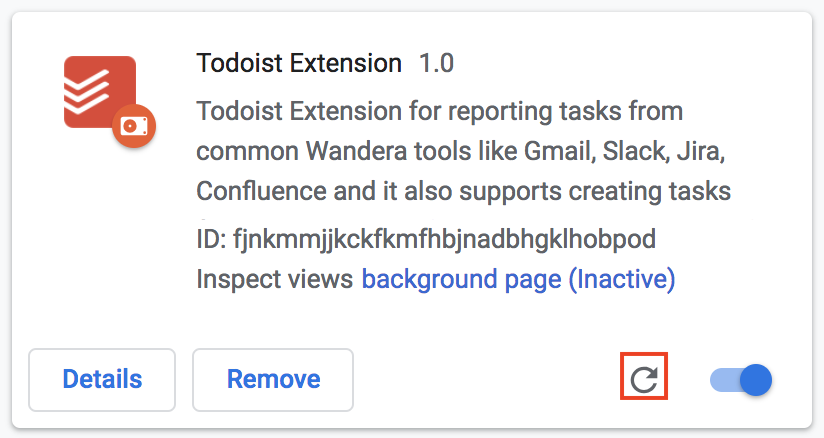
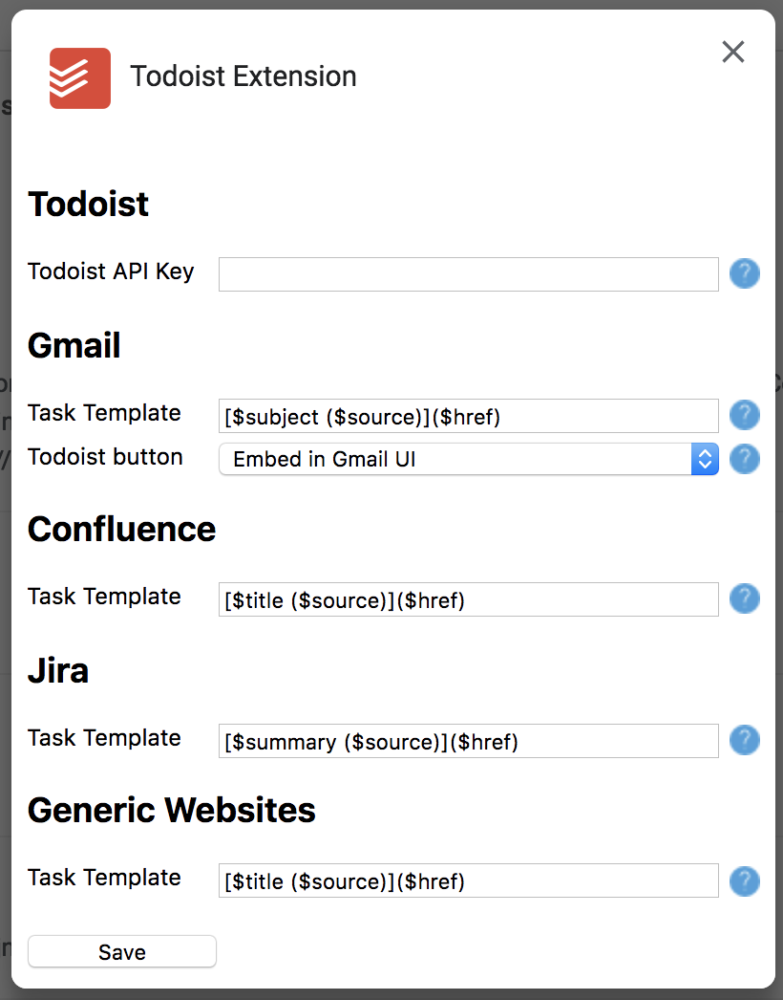
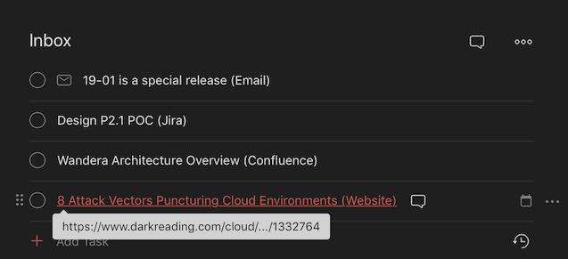

# Wandera Todoist plugin for Crome
Plugin will allow you to create a todoist tasl from Jira ticket, Gmail, Confluence page or any other generic website with a single click.

### Installation
Unfortunately the plugin is not in official Chrome store so installation is not as easy as official installation but you can still install it pretty easily by following these steps:
1) Clone the repository from https://github.com/Skamaniak/TodoistChromeExtension.git 
2) Go to chrome://extensions
3) Enable Developer mode in the upper right corner of the screen
4) Click "Load Unpacked" button in the upper left corner
5) Select folder which contains the cloned plugin repository

And that's it. If you want to update plugin, you can just git pull the repository and refresh the plugin on the Chrome extension page
 

### Configuration
Before you start using the plugin, you need to fill in the todoist API key. You can get the key this way
1) Log into https://todoist.com
2) Click the cog icon in the upper right corner and select Settings
3) Navigate to Integrations section and scroll down to API token 
4) Right-click at the plugin icon in the browser and select Options
5) Fill in the Todoist API token and save the dialog

Voila! Everything should be now ready.

Options dialog contains more options for configuration
 

Using the dialog you can configure templates used for creation of Todoist tasks. In default, plugin creates tasks as shown in the following picture
 

As you can see, inbox contains 4 tasks - one created from email, jira issue, confluence page and generic website.
Each task is clickable and navigates directly to the resource from which it was created (e.g. directly to email detail)

You can customise the templates as you will, each one of them has multiple parameters. To see all available parameters, hover over the question mark icon in the Options dialogue.

### Feedback
Any feedback welcomed! please feel free to contact me at jan.skrabal(at)wandera.com.

Happy using!
